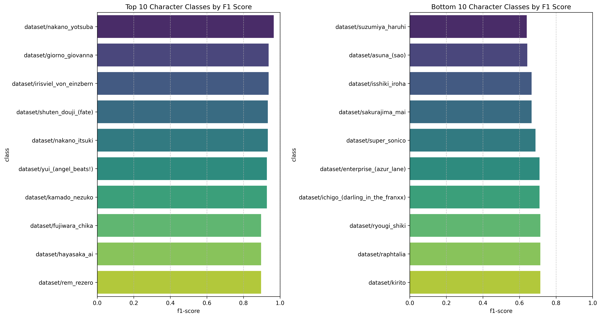
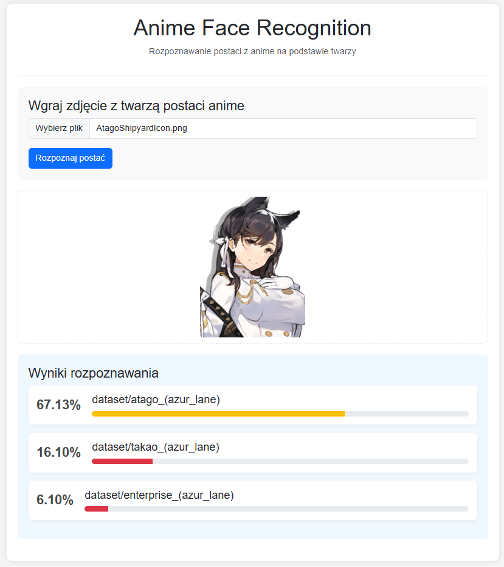
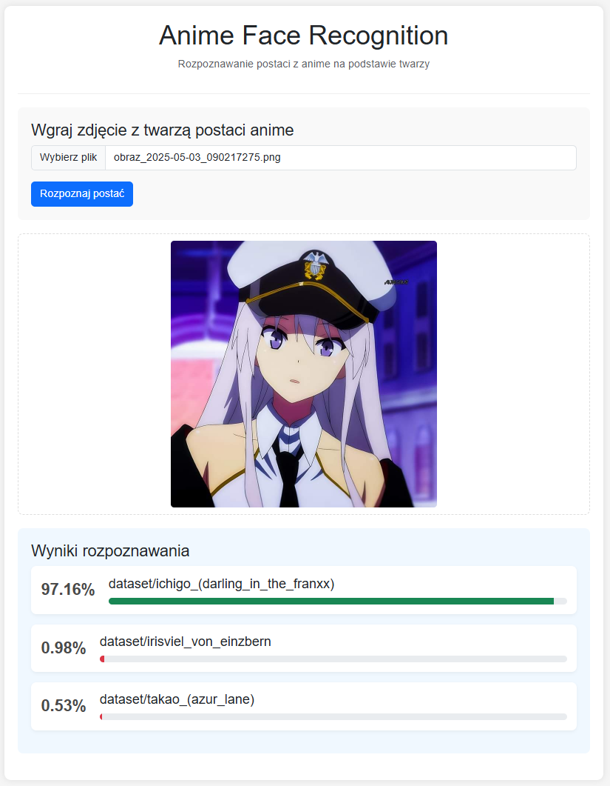

# Anime face recognition

An app for recognizing anime characters' faces using machine learning.

## Description

Project uses machine learning and computer vision techniques to recognize anime characters based on their faces. The model was trained on a dataset containing images of anime characters' faces.

## Functions

- Anime character face recognition
- Returning match probability for top-3 characters
- Web interface for easy testing
## Technologies

- TensorFlow/Keras - Model building and training
- Flask - Web app backend
- OpenCV - Image processing
- Docker - Application containerization

## Installation

### Requirements
- Python 3.8+
- Docker

### Kaggle API configuration
1. Sign up for [Kaggle](https://www.kaggle.com) (if you don't have an account yet)
2. Go to your account settings (click on your profile picture)
3. Scroll to the "API" section and click "Create New API Token"
4. Download the kaggle.json file
5. Place this file in the project root (it will be copied to the container)

### instalation

```bash
# Cloning the repository
git clone https://github.com/olimo54323/anime_face_recognition.git
cd anime-face-recognition 

# Building Docker image
docker build -t anime-face-recognition .

# open docker in interactive mode
docker run -it -p 5000:5000 --rm anime-face-recognition bash
```
- run command for dataset download:
```bash
python scripts/download_dataset.py
```
- run command for model training:
```bash
python scripts/train_model.py
```

- run command for model evaluate:
```bash
python scripts/evaluate_model.py
```
- run the flask app:
```bash
export FLASK_APP=app/app.py
export FLASK_DEBUG=1
export PYTHONUNBUFFERED=1
flask run --host=0.0.0.0 --port=5000
```

### First results (based on smaller quantity of pictures)
1. class performance:

2. confidence analysis:

3. evaluation_raport.txt:
```
===== ANIME FACE RECOGNITION MODEL EVALUATION =====
Date: 2025-05-02 19:22:49
Model: models/anime_face_recognition_model.h5
Dataset: dataset
Image size: 128x128

PERFORMANCE METRICS:
  Accuracy: 0.8003
  Top-3 Accuracy: 0.9228
  Top-5 Accuracy: 0.9561
  Precision: 0.8148
  Recall: 0.8003
  F1 Score: 0.7999

SPEED METRICS:
  Average inference time: 4.65 ms per image
  Images per second: 215.04
```

model at this point is not correct (example session):

good:

bad:


## Authors
- Grzegorz Urbański
- Wiktor Kaszuba