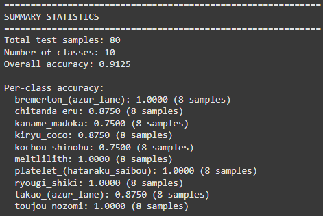

# Anime Face Recognition

A web application for recognizing anime characters using machine learning and computer vision techniques.

## Description

This project uses deep learning to identify anime characters from uploaded images. The model was trained on a dataset containing anime character faces and can predict the top 3 most likely character matches with confidence scores.

## Features

- **Anime Character Recognition** - Upload an image and get top 3 character predictions
- **Web Interface** - Easy-to-use Flask web application
- **Real-time Processing** - Fast image analysis and prediction
- **Responsive Design** - Works on desktop and mobile devices
- **Model Information** - Display available character classes

## Technologies Used

- **TensorFlow/Keras** - Deep learning model (ResNet50-based transfer learning)
- **Flask** - Web application framework
- **OpenCV** - Image processing and computer vision
- **Docker** - Containerization for easy deployment
- **HTML/CSS/JavaScript** - Frontend interface

## Model Details

- **Architecture**: Transfer learning with ResNet50 pre-trained on ImageNet
- **Classes**: 5 anime characters (Gawr Gura, Jonathan Joestar, Nakano Yotsuba, Rider, Takarada Rikka)
- **Input Size**: 224x224 RGB images
- **Output**: Top 3 predictions with confidence scores

## Installation & Setup

### Prerequisites
- Docker installed on your system
- Python 3.8+ (for local development)

### Quick Start with Docker

1. **Clone the repository**
   ```bash
   git clone https://github.com/olimo54323/anime_face_recognition.git
   cd anime-face-recognition
   ```

2. **Build Docker image**
   ```bash
   docker build -t anime-face-recognition .
   ```

3. **Run the application**
   ```bash
   docker run -d --name anime-app -p 5000:5000 anime-face-recognition
   ```

4. **Access the application**
   Open your browser and navigate to: `http://localhost:5000`

## Usage

1. **Upload Image**: Select an anime character image (PNG, JPG, JPEG, GIF, BMP)
2. **Analysis**: The application processes the image using the trained model
3. **Results**: View top 3 character predictions with confidence scores
4. **Repeat**: Analyze more images as needed

## Model Training Process

The model was trained using the following approach:

1. **Dataset**: Anime face dataset from Kaggle
2. **Preprocessing**: Images resized to 224x224, ResNet50 preprocessing applied
3. **Architecture**: ResNet50 base + Global Average Pooling + Dense layers
4. **Training**: Transfer learning with frozen ResNet50 weights
5. **Evaluation**: Confusion matrix and classification reports generated

## Model Performance

- **Training Accuracy**: Achieved good performance on selected character classes
- **Validation**: Proper train/validation/test split maintained
- **Preprocessing**: Consistent image preprocessing between training and inference

## Technical Implementation

### Key Components:

- **Image Processing**: OpenCV for image loading and preprocessing
- **Model Loading**: TensorFlow/Keras model loading with error handling
- **Web Framework**: Flask with file upload and template rendering
- **Containerization**: Docker for consistent deployment environment

### Preprocessing Pipeline:
1. Image loading with OpenCV
2. Resize to 224x224 pixels
3. Convert to float32
4. Apply ResNet50 preprocessing (ImageNet normalization)
5. Add batch dimension for model input

## 🚨 Important Notes
- **Training Data**: Original training was performed in Google Colab using Kaggle datasets
- **Performance**: Application includes fallback handling when model files are unavailable


## Trained model conclusion:




## Authors

- **Grzegorz Urbański**
- **Wiktor Kaszuba**