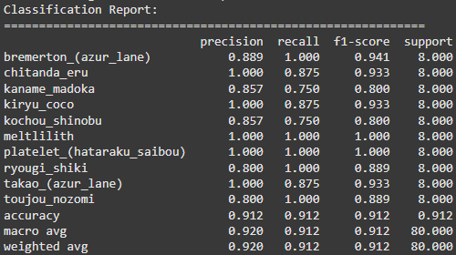

# Anime face recognition

An app for recognizing anime characters' faces using machine learning.

## Description

Project uses machine learning and computer vision techniques to recognize anime characters based on their faces. The model was trained on a dataset containing images of anime characters' faces.

## Functions

- Anime character face recognition
- Web interface for easy testing
## Technologies

- TensorFlow/Keras - Model building and training, image preprocessing
- Flask - Web app backend
- cv2 - Image tool

## Installation

### Requirements
- Python 3.8+
- google colab/jupiter

## First model (small number of classes: 5) conclusion:

## Authors
- Grzegorz Urbański
- Wiktor Kaszuba